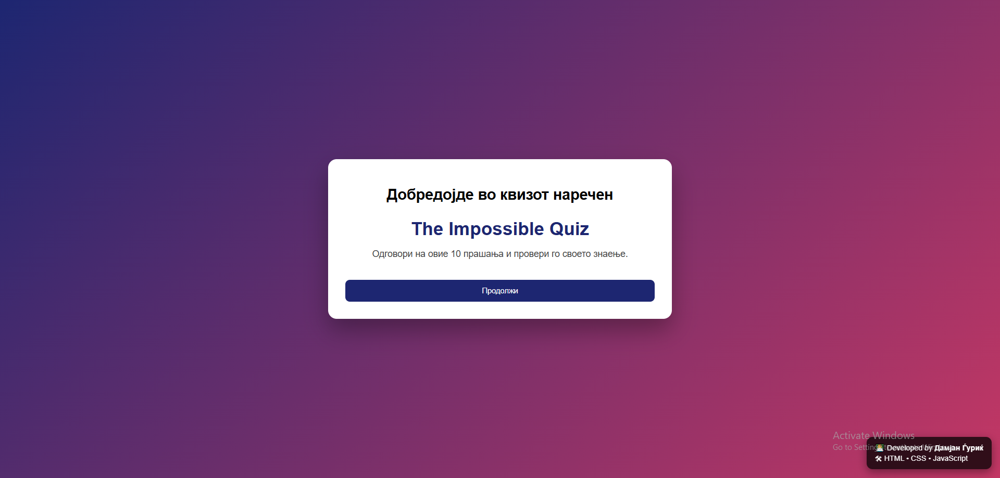
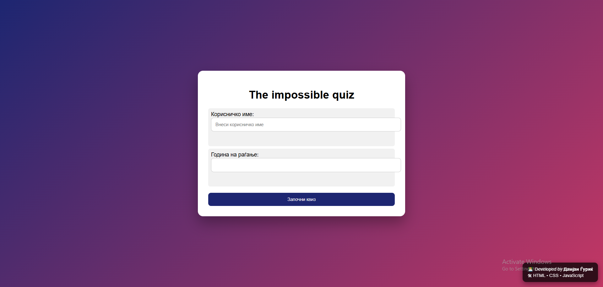
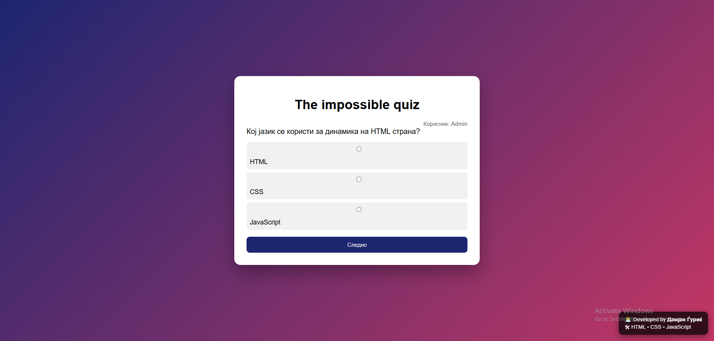
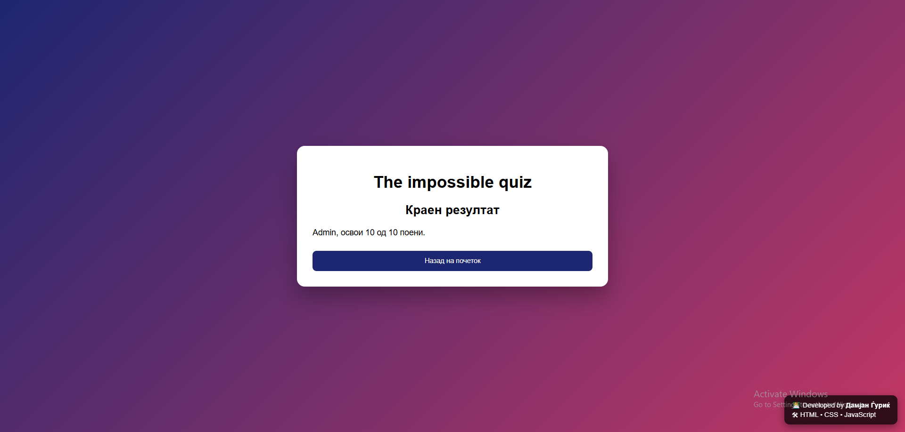

# 📝 Quiz
Проектот Quiz е веб апликација за решавање квизови и проверка на знаење. Проектот е изработен како училишен проект со цел практична примена и усовршување на знаењата од веб програмирање.

---

## 📌 Главни функции

- User registration and login
- Multiple quiz categories
- Randomized questions
- Automatic score calculation
- Result history
- User-friendly interface
- Database support

---

## 🛠 Користени технологии

- HTML5
- CSS3
- JavaScript
- PHP
- MySQL
- XAMPP

---

## 📷 Screenshots

### 🏠 Home Page



---
### 💻 Enter Data



---

### ❓ Questions



---

### ✅ Final result



---

## ⚙ Инсталација

1. Клонирај го репозиториумот.
2. Копирај ја папката во xampp/htdocs.
3. Стартувај ги Apache и MySQL преку XAMPP.
4. Импортирај ја базата kviz_podatoci.sql во phpMyAdmin.
5. Отвори:
http://localhost/Quiz

---

## 📂 Project Structure

```text
Quiz
│
├── Database/
│   └── kviz_podatoci.sql
│
├── Screenshots/
│   ├── enter-data.png
│   ├── Final-result.png
│   ├── Home-page.png
│   └── Questions.png
│
├── Source/
│   ├── Index.html
│   ├── insert.php
│   ├── Script.js
|   └── Style.css
│
├── README.md
└── LICENSE
```

---

## 👨‍💻 Author

Damjan Gjurik
